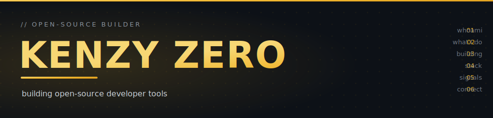
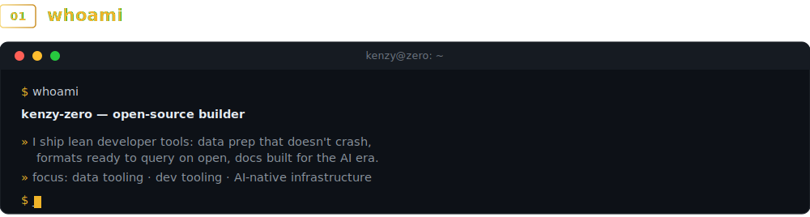
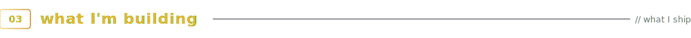
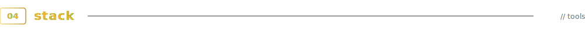

<!-- ============ custom hero ============ -->


<!-- ============ quick links ============ -->
<p align="center">
  <a href="https://pypi.org/project/kenze/"></a>
  <a href="https://github.com/Kenzy-Zero?tab=repositories"></a>
  <a href="mailto:kenzy.zero.k0@gmail.com"></a>
  
</p>

<br/>

<!-- ============ 01 whoami ============ -->


<br/><br/>

<!-- ============ 02 what I do ============ -->


> I turn **large-scale location & movement data into decisions** — the maps, audiences and models
> behind real products. Years of building **data & location-intelligence** systems end to end:
> data pipelines, geospatial analysis, and the tools that make big data actually usable.

- 🛰️ Building a **location-intelligence platform** — turning *where people go* into planning & insight
- 🗺️ Comfortable across the whole path: raw data → pipelines → geospatial analysis → shipped product
- 🧠 Drawn to problems where **data meets the real world**

<br/>

<!-- ============ 03 what I'm building ============ -->


#### 🦆 kenze &nbsp;·&nbsp; <sub>shipped & live</sub>

> **Big-file data prep that never runs out of memory** — an interactive shell *and* a one-line CLI.
> Clean and reshape CSV / Parquet / JSON / Excel files that are too big for pandas. DuckDB does the
> heavy lifting; kenze auto-sizes memory so your job never crashes. No SQL required — no lock-in either.

```bash
pip install kenze          # then just run:  kenze
```

<p>
  <a href="https://github.com/Kenzy-Zero/kenze"></a>
  <a href="https://pypi.org/project/kenze/"></a>
  <a href="https://pypi.org/project/kenze/"></a>
  <a href="https://github.com/Kenzy-Zero/kenze/actions"></a>
  <a href="https://github.com/Kenzy-Zero/kenze/stargazers"></a>
</p>

#### 🅺 K-Series &nbsp;·&nbsp; <sub>in development</sub>

> **Big data, intelligence-ready.** A smarter geospatial data format + SDK. **K1** is a self-describing,
> H3-sorted GeoParquet format (`.k1`) that replaces "dumb" Parquet; **K2** is a DuckDB-powered analysis &
> sharing layer (`.k2`). Built for location data that's ready to query the moment you open it.

<p>
  
  
</p>

#### 🆉 Z-Series &nbsp;·&nbsp; <sub>in development</sub>

> **The open documentation standard for the AI era.** `.z1` files are AI-native docs — machine-first,
> around 10× fewer tokens than a README, built on the bet that AI is the new discovery layer. A family
> of formats (identity, API, changelog…) modeled on how robots.txt, Markdown and schema.org became standards.

<p>
  
  
</p>

<br/>

<!-- ============ 04 stack ============ -->


<p>
  
  
  
  
  
  
  
  
  
</p>

<br/>

<!-- ============ 05 signals ============ -->


<p align="center">
  
</p>


<br/>

<!-- ============ 06 connect ============ -->


<p>
  <a href="https://github.com/Kenzy-Zero"></a>
  <a href="mailto:kenzy.zero.k0@gmail.com"></a>
  <a href="https://pypi.org/project/kenze/"></a>
</p>

<sub>🔜 More coming soon — X · LinkedIn · Instagram · Reddit</sub>

<!-- ============================================================
  SOCIALS TO ADD LATER — uncomment a line and drop in your URL,
  then paste the same link into GitHub Settings → Public profile →
  "Social accounts" so it also shows in your left sidebar.

  <a href="https://x.com/YOUR_HANDLE"></a>
  <a href="https://www.linkedin.com/in/YOUR_HANDLE"></a>
  <a href="https://www.instagram.com/YOUR_HANDLE"></a>
  <a href="https://www.reddit.com/user/YOUR_HANDLE"></a>
============================================================ -->

<br/><br/>


